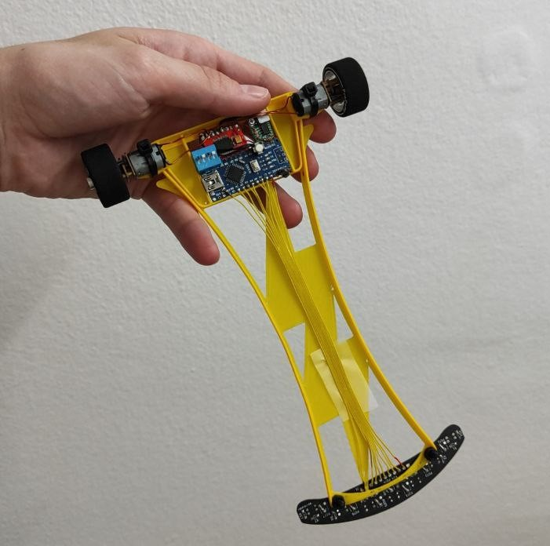
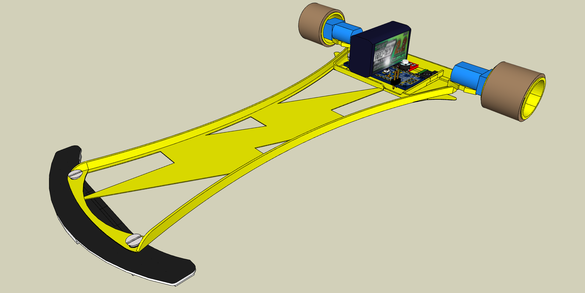

# KizaruBot2

Versión 2 de Kizaru. Más ligero, rápido, y competitivo. "Confiable Kizaru"

## Hardware
- Arduino Nano
- Driver de motores TB6612FNG
- 2x Motores "Pololu" N20 @2000rpm
- DIP Switch 4p
- LiPo 3S ~180 mAh
- PCB con 7x Sensores QRE1113
- Goma de ruedas hecha a medida con Uretano/Vitaflex20
- Chasis completamente impreso en PLA

